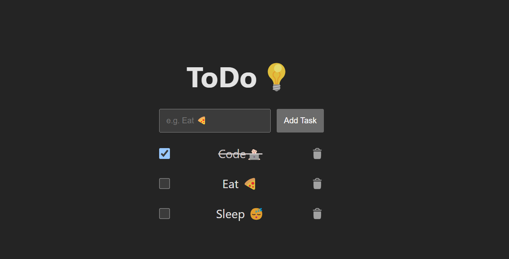
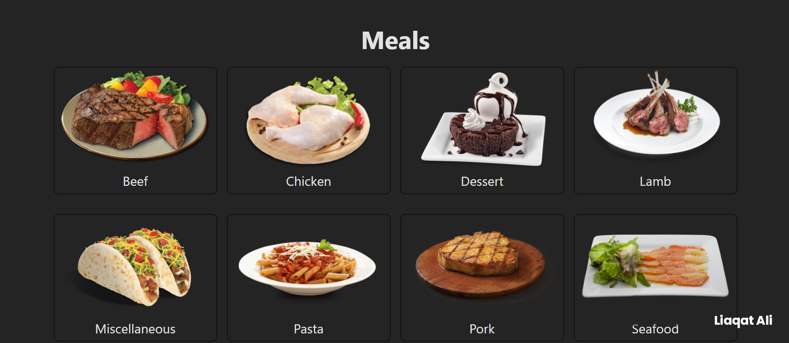
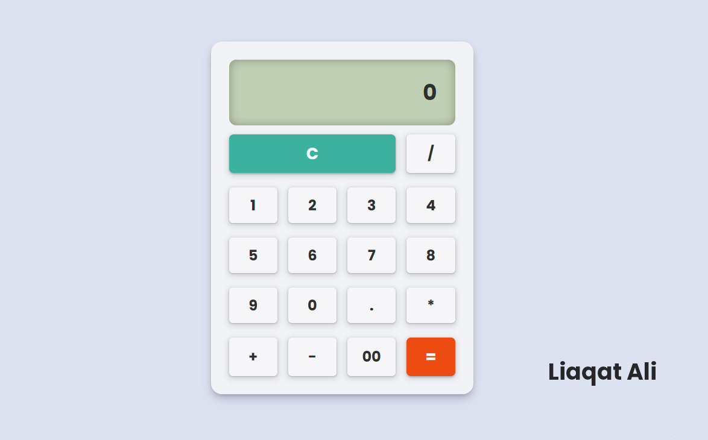

# 🚀 React Playground

Welcome to my collection of beginner-friendly React projects! This repository is aimed at helping aspiring developers get hands-on experience by building small but practical apps using React.

Whether you're new to React or brushing up your skills, these projects cover essential concepts like components, props, state, event handling, conditional rendering, and more.

---

## 📁 Projects

| Project                              | Description                                                                              |
| ------------------------------------ | ---------------------------------------------------------------------------------------- |
| [📝 ToDo App](#todo-app)             | A simple To-Do List app where users can add, delete, and mark tasks as completed or not. |
| [🍽 Meals App](#meals-app)            | A React app that fetches and displays meal categories from TheMealDB API.                |
| [➗ Calculator App](#calculator-app) | A basic calculator for expressions evaluation.                                           |

---

### 📝 <a name="todo-app"></a> ToDo App

A basic yet functional To-Do List app built with React. It helps users manage daily tasks by letting them:

- ✅ Add new tasks
- ❌ Delete tasks
- 🔁 Mark tasks as complete/incomplete



**Tech Used:**  
React, JavaScript, HTML, CSS

> This is a great beginner project to understand state management and list rendering in React.

---

---

### 🍽 <a name="meals-app"></a> Meals App

A simple React project that fetches and displays various meal categories from [TheMealDB API](https://www.themealdb.com/). It showcases:

- 📦 Fetching API data using `useEffect`
- 🔄 Conditional rendering (loading, error, data states)
- 🖼 Displaying meal categories with images and titles



**Tech Used:**  
React, JavaScript, HTML, CSS

> A great project to understand API calls and conditional rendering in React.

---

### ➗ <a name="calculator-app"></a> Calculator App

A simple calculator built using React that performs basic arithmetic operations. It uses an input-based interface where users can enter expressions just like on a regular calculator.

- ➕ Add
- ➖ Subtract
- ✖️ Multiply
- ➗ Divide



**Tech Used:**  
React, JavaScript, HTML, CSS

⚠️ **Note:** This app uses JavaScript's built-in `eval()` function to evaluate expressions.

> While convenient for learning and quick prototyping, `eval()` is **not recommended** for production apps due to **security vulnerabilities** and **unpredictable behavior**.  
> Consider using a library like [`mathjs`](https://mathjs.org/) or building a custom parser for safer calculations.

---

### 📦 How to Run

```bash
# Clone the repo
git clone https://github.com/liaqatXD/react-playground

# Navigate into the desired folder, e.g.
cd react-playground/toDo

# Install dependencies
npm install

# Run the app
npm start
```
